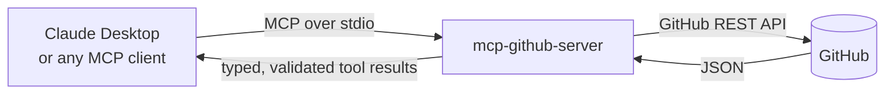

# mcp-github-server

[](https://github.com/sagar3799/mcp-server/actions/workflows/ci.yml)

An [MCP](https://modelcontextprotocol.io) server exposing GitHub repository data —
commits, issues, contributor activity — as typed, callable tools that any
MCP-compatible LLM client (Claude Desktop, Claude Code, others) can discover and use.

## Architecture



The client launches `server.py` as a local subprocess and talks to it over
stdio using the MCP protocol — no network server to run or expose.

## Tools

| Tool | Description |
|---|---|
| `repo_summary(owner, repo)` | Stars, language breakdown, description, last commit date |
| `recent_commits(owner, repo, count=10)` | Recent commit messages, authors, dates |
| `open_issues(owner, repo, count=10)` | Open issue titles, labels, age in days |
| `contributor_stats(owner, repo, count=10)` | Top contributors by commit count on the default branch |
| `codebase_insights(owner, repo)` | Language breakdown as percentages, plus repo size in KB |
| `commit_frequency(owner, repo, weeks=12)` | Weekly commit counts — pure counting, no categorization |
| `search_codebase(owner, repo, query, count=10)` | Search code in the default branch — **requires `GITHUB_TOKEN`** |

Six of seven tools work against any public GitHub repo with **zero setup** — no
token, no auth, no config beyond pointing a client at this server. Responses are
Pydantic-validated (`RepoSummary`, `Commit`, `Issue`, `Contributor`,
`CodebaseInsights`, `WeeklyCommitCount`, `CodeSearchResult`) and cached in-memory
for 5 minutes, so repeated identical calls don't re-hit the GitHub API.

**`search_codebase` is the one exception**: GitHub's code search sits in its own,
much stricter rate-limit bucket (`code_search`, separate from `core`) that isn't
reliable unauthenticated, so this tool requires `GITHUB_TOKEN` and returns a clear
error without it, rather than silently failing under load. It also only indexes a
repo's **default branch** and excludes some large files and forks — a query can
legitimately come back empty for code that exists elsewhere in the repo.

**`commit_frequency` note**: it calls GitHub's stats endpoint, which computes
results asynchronously for repos it hasn't cached recently. On a cold cache it
returns a "still computing, try again in a few seconds" message instead of an
empty or wrong result — this is a real GitHub API quirk, not a bug here.

## Setup

```bash
python -m venv .venv
.venv/Scripts/activate   # .venv/bin/activate on macOS/Linux
pip install -e ".[dev]"
```

### Optional: higher rate limit

Unauthenticated requests are capped at 60/hour by GitHub, which is fine for a demo.
Set `GITHUB_TOKEN` (copy `.env.example` to `.env`) for 5,000/hour — never required.

## Running

```bash
python src/server.py
```

The server communicates over stdio — it's meant to be launched as a subprocess by
an MCP client, not run standalone for interactive use.

### Connect to Claude Desktop

Add to `claude_desktop_config.json`:

```json
{
  "mcpServers": {
    "github-intelligence": {
      "command": "/absolute/path/to/.venv/Scripts/python.exe",
      "args": ["/absolute/path/to/src/server.py"]
    }
  }
}
```

Restart Claude Desktop, then ask something like *"what are the 5 most recent
commits on \<owner\>/\<repo\>?"*

## Tests

```bash
pytest tests/
```

GitHub's API is fully mocked — no live network or token needed to run the suite.

## Why MCP instead of a REST API

A REST API requires the caller to already know its exact endpoints and response
shapes ahead of time — someone has to read docs and write integration code for
that specific API before anything can use it. An MCP server instead *advertises*
its own tools, descriptions, and expected inputs at runtime, so any compatible
client can discover and call them without custom integration code being written
per API. This project is a callable capability an LLM can reason about choosing
to use, not a fixed endpoint a human developer wires up by hand once.
